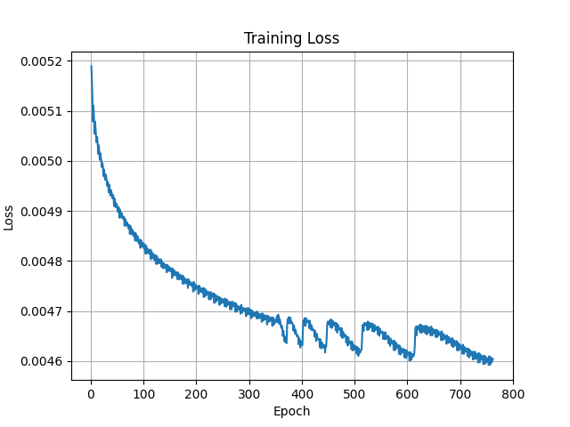

# NNUE-Trainer

This is the C++ CPU trainer for Superultra's (my chess engine) NNUE. The architecture of the most recent network is (768x10-->512)x2-->1 and was trained on 3 billion positions from the <a href="https://lczero.org/blog/2021/04/jumping-on-the-nnue-bandwagon">lc-fish project</a>. The network has perspective, 10 king buckets (mirrored), and 8 output weight buckets based on the number of pieces remaining. 

The trainer supports multithreading, fen skipping, ADAM optimization, and cosine annealing. It reads data directly off binpacks thanks to the Stockfish binpack reading code. Note that the trainer assumes scores are on a centipawn scale and that the data is prefiltered (a score of 32002 indicates that the position is skipped). Furthermore, the score and result (-1/0/1) is relative to the side to move. Finally, note that one "epoch" is around 100 million positions.

 

The image above is the loss graph of the most recent network with the first few epochs ommited in order for the graph to be less zoomed out.
